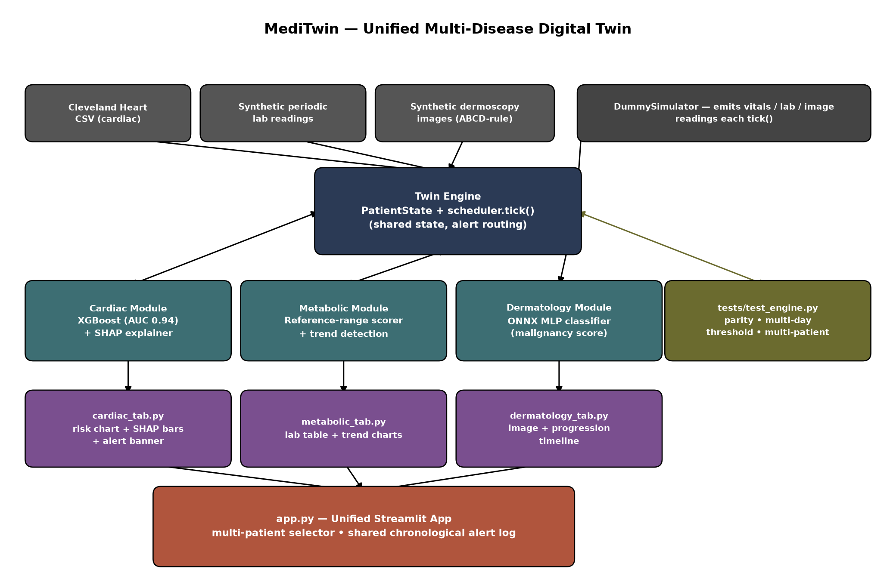

# MediTwin — Unified Multi-Disease Digital Twin Platform

Submission for the **Digital Twin Challenge 2026** (Happiest Health).

## Problem

Most risk-prediction tools score a patient once from a single snapshot.
MediTwin instead keeps one evolving **digital twin** per patient — a
`PatientState` that gets re-scored on every new vitals / lab / skin reading —
across three organ systems: **cardiac**, **metabolic**, and **dermatology**
(stretch goal), unified behind a single multi-patient Streamlit app.

See [`docs/methodology.md`](docs/methodology.md) for data sources, model
details, and limitations, and `docs/architecture.png` for the full data-flow
diagram.

## Architecture



A shared **Twin Engine** (`twin_engine/`) advances simulated time and routes
each new reading to the module that owns it. Each module keeps its own
`risk_scores[...]` entry up to date; a persistent header (patient EHR summary
+ a low-poly 3D humanoid that highlights the relevant organ) sits above a
segmented module selector; `app.py` unifies all three behind a patient
selector and one chronological alert log.

## Structure

```
twin_engine/          core patient-state engine + tick scheduler (incl. occasional
                       cardiac stress episodes — see Cardiac Alarm below)
modules/cardiac/       XGBoost (AUC ≈ 0.92 on this build's own held-out split) + SHAP explainer, rolling vitals features
modules/metabolic/     reference-range lab scorer + trend detection
modules/dermatology/   ONNX MLP skin-lesion classifier (stretch goal) + synthetic
                        dermoscopy image generator (no DermNet access in this
                        build environment — see docs/methodology.md)
dashboard/             patient_header.py (persistent EHR + 3D organ-highlight model),
                        cardiac_alarm.py (flashing/beeping high-risk alert),
                        cardiac_tab.py, metabolic_tab.py, dermatology_tab.py
app.py                 unified multi-patient app tying all three modules together;
                        sidebar alert log filters to whichever module tab is active
config.py               shared alert thresholds (single source of truth)
data/cardiac/          Cleveland Heart Disease CSV
tests/test_engine.py   parity, multi-day, alert-threshold, multi-patient checks
docs/                  methodology.md, architecture.png
.github/workflows/     CI: lint (flake8) + test suite on every push/PR
```

## Persistent Patient Header

Above the module selector, a header shows the active patient's EHR baseline
(age, sex, cholesterol, resting BP) alongside a low-poly 3D humanoid
(Three.js, embedded via `st.iframe`). The humanoid highlights whichever
organ the selected module concerns — heart for Cardiac, kidney/liver region
for Metabolic, whole-body tint for Dermatology — driven by
`st.session_state.active_module` (a segmented radio control stands in for
`st.tabs()`, since tabs don't report their active selection back to Python).

## Cardiac: live vitals + alarm

The Cardiac tab shows the patient's current heart rate, SpO2, and resting BP
as live metrics, plus a recent-vitals chart (last 60 readings). The
simulator occasionally runs a short "stress episode" — elevated resting BP
paired with a heart rate that fails to rise with it (chronotropic
incompetence, a real risk marker also reflected in the underlying Cleveland
training data) — so cardiac risk genuinely fluctuates rather than sitting
flat, and crosses the alert threshold a handful of times per session rather
than never or constantly (verified in-repo: ~100/500 simulated vitals ticks
above threshold per default patient). When it does, a flashing red banner
with a best-effort audio beep (hospital-monitor style) replaces the normal
status banner. The sidebar alert log filters to whichever module tab is
currently active.

## Setup

```bash
pip install -r requirements.txt
streamlit run app.py
```

First run trains and caches each module's model locally (`artifacts/`
folders, gitignored) — a few seconds, then instant on later runs.

## Testing

```bash
python3 tests/test_engine.py
```

Runs 8 checks (per-module parity vs. the underlying model, 60-tick multi-day
consistency, threshold-breach alerts, multi-patient personalization) with no
pytest dependency required.

## Status

All 11 build-plan steps complete, including the dermatology stretch goal.
See `docs/methodology.md` §7 for known limitations (synthetic data for two
of the three modules, no real EHR/wearable integration, hackathon-scope
prototype — not for clinical use).
