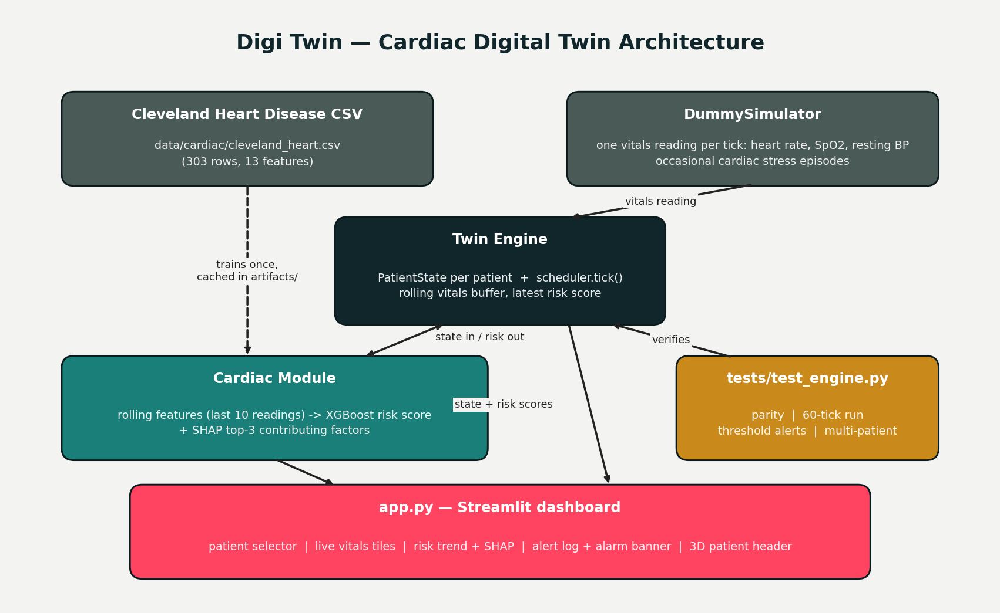

# Digi Twin — Cardiac Digital Twin

[](https://github.com/harsh23533-del/digital-twin-/actions/workflows/ci.yml)

A live, explainable cardiac digital twin for multiple simulated patients,
built for the **Digital Twin Challenge 2026 (Happiest Health)**.

Most risk tools score a patient once from a single snapshot. Digi Twin keeps
one evolving twin per patient and re-scores it on every new vitals reading, so
risk is a continuously updated line, and every score comes with the factors
that drove it.

## Features

- **Live cardiac risk** from an XGBoost model trained on the Cleveland Heart
  Disease dataset, re-scored on every tick.
- **Explainable**: SHAP shows the top contributing factors for each score.
- **Multi-patient**: switch between patients, each with an independent state.
- **Realistic demo data**: a simulator with occasional cardiac stress
  episodes (high resting BP with a heart rate that fails to rise), so the
  risk score visibly moves.
- **Alerts**: a chronological, edge-triggered alert log plus a flashing
  alarm banner when risk crosses the threshold.
- **Live BLE heart-rate mode**: optionally feed the twin from a real
  Bluetooth heart-rate device instead of the simulator — see
  [`docs/live_watch.md`](docs/live_watch.md).
- **Dashboard**: vital-sign tiles, risk trend, SHAP chart, and a 3D patient
  figure with the heart highlighted.

## Quick start

Requires Python 3.12 (the version CI uses).

```bash
pip install -r requirements.txt
streamlit run app.py
```

The first run trains the model from the bundled CSV and caches it in
`modules/cardiac/artifacts/` (gitignored); this takes a few seconds and later
runs load instantly. In the app, click **Auto-run** in the sidebar to watch the
twin update live, or **Advance** to step through ticks manually.

## How it works



Each tick, the simulator emits a vitals reading, the twin engine stores it on
the patient's state, and the cardiac module rebuilds the model input from the
patient's EHR baseline plus a rolling window over recent vitals, then scores
it and attaches a SHAP explanation. See [`docs/methodology.md`](docs/methodology.md)
for data, model details, validation, and limitations.

## Project structure

```
app.py                     Streamlit app: patient selector, vitals, charts, alerts
config.py                  Alert threshold (single source of truth)
twin_engine/
  patient_state.py         PatientState: EHR profile, vitals buffer, risk scores
  scheduler.py             DummySimulator + tick loop
  live_heart_rate.py       Optional real BLE heart-rate source (see docs/live_watch.md)
modules/cardiac/
  model.py                 XGBoost training, caching, SHAP explainer
  rolling_features.py      EHR baseline + rolling vitals -> model features
  cardiac_module.py        Scores a PatientState and stores the explanation
dashboard/
  patient_header.py        Patient info panel with the 3D figure
  cardiac_alarm.py         Flashing / beeping high-risk banner
data/cardiac/              Cleveland Heart Disease CSV
tests/test_engine.py       Parity, multi-day, alert-threshold, multi-patient checks
docs/                      Methodology, architecture diagram (+ its generator), live-watch setup
.github/workflows/ci.yml   flake8 + tests on every push and PR to main
```

## Development

```bash
make install   # runtime + dev dependencies
make run       # start the app
make test      # run the test suite (no pytest needed)
make lint      # flake8
make docs      # regenerate docs/architecture.png
```

Without `make`, run the underlying commands directly, for example
`python3 tests/test_engine.py`.

## Limitations

Hackathon-scope prototype. The training set is small (about 300 rows), the
vitals are simulated, and there is no authentication, persistence, or real
patient data. **Not intended for clinical use.** More in
[`docs/methodology.md`](docs/methodology.md#9-limitations).
